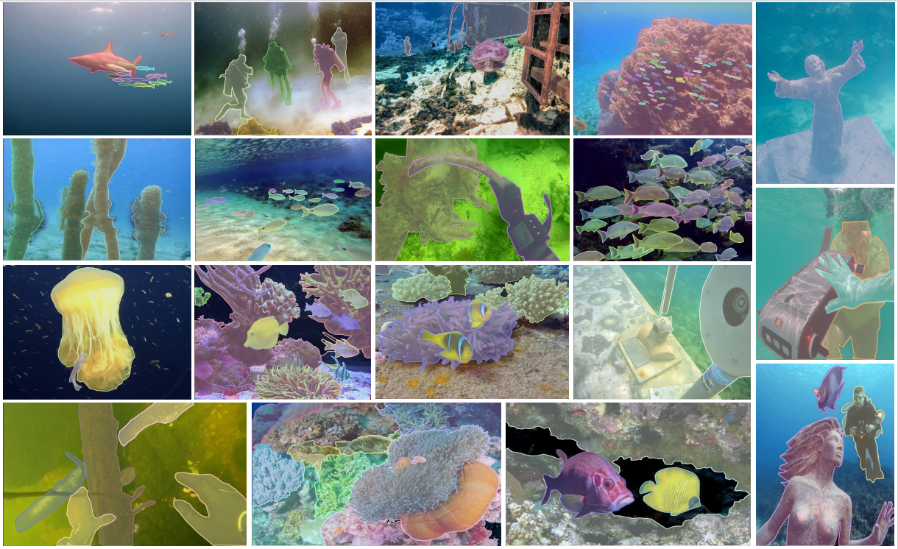

# WaterMask

This repo is the official implementation of "[WaterMask: Instance Segmentation for Underwater Imagery]()". By Shijie Lian, Hua Li, Runmin Cong, Suqi Li, Wei Zhang, Sam Kwong, and has been accepted by ICCV2023! 🎉🎉🎉

### :rocket: Highlights:
- **UIIS dataset**: We construct the first general Underwater Image Instance Segmentation (UIIS) dataset containing 4,628 images for 7 categories with pixel-level annotations for underwater instance segmentation task.
  
  
- **SOTA performance**: We propose the first underwater instance segmentation model, WaterMask, as far as we know, which achieves good performance in qualitative and quantitative comparisons with natural image instance segmentation SOTA methods.
  
  

### Requirements
* Python 3.6+
* Pytorch 1.3+
* mmcv-full>=1.3.17, \<1.6.0 (we use mmcv 1.5.3 and mmdetection 2.25.1 in code)

and you need use `pip install -v -e .` to install mmdetection.

### Datasets
    data
      ├── UDW
      |   ├── annotations
      │   │   │   ├── train.json
      │   │   │   ├── val.json
      │   ├── train
      │   │   ├── L_1.jpg
      │   │   ├── ......
      │   ├── val

you can get our UIIS dataset in [Baidu Disk](https://pan.baidu.com/s/1owt1KZTnxzpSBiXxULtvCg) (pwd:fiuk) or [Google Drive](https://drive.google.com/file/d/1MwGvsr2kJgKBGbU3zoZlXiqSSiP1ysGR/view?usp=sharing)

### Training
`python tools/train.py configs/_our_/water_r50_fpn_1x.py --work-dir you_dir_to_save_logs_and_models`

### Citation
If you find our repo useful for your research, please cite us:
```
@inproceedings{lian2023watermask,
    title={WaterMask: Instance Segmentation for Underwater Imagery},
    author={Shijie Lian, Hua Li, Runmin Cong, Suqi Li, Wei Zhang, Sam Kwong},
    booktitle={Proceedings of the IEEE/CVF International Conference on Computer Vision},
    year={2023}
}
```

### License
This project is released under the [Apache 2.0 license](LICENSE).
