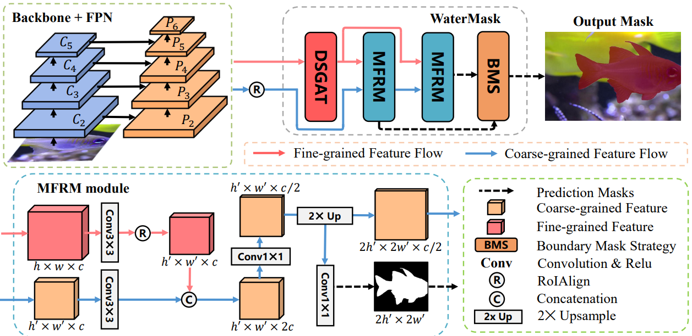

# WaterMask


---

### :speech_balloon: Updates：UIIS10K

[**UIIS10K**](https://github.com/LiamLian0727/UIIS10K/blob/main/README.md) upgrades the original UIIS dataset with **10 048 underwater images** annotated at **pixel level** for **10 object classes** (fish · reptiles · artiodactyla · mollusks · corals · plants · garbage · ruins · divers · robots).

- **Largest underwater benchmark** – more images and masks than any existing general underwater instance segmentation dataset.  
- **Scene diversity** – shallow & deep water, clear & turbid conditions, multiple resolutions, complex backgrounds, heavy occlusions.  
- **Crowded scenes** – 23 % of images contain ≥ 5 instances.  (up to 80+ per image).  
- **Multi-task ready** – pixel masks + bounding boxes support instance segmentation, object detection, and semantic segmentation.

---

This repo is the official implementation of "[WaterMask: Instance Segmentation for Underwater Imagery](https://openaccess.thecvf.com/content/ICCV2023/html/Lian_WaterMask_Instance_Segmentation_for_Underwater_Imagery_ICCV_2023_paper.html)". By Shijie Lian, Hua Li, Runmin Cong, Suqi Li, Wei Zhang, Sam Kwong, and has been accepted by ICCV2023! 🎉🎉🎉

### :rocket: Highlights:
- **UIIS dataset**: We construct the first general Underwater Image Instance Segmentation (UIIS) dataset containing 4,628 images for 7 categories with pixel-level annotations for underwater instance segmentation task.
  
  
- **SOTA performance**: We propose the first underwater instance segmentation model, WaterMask, as far as we know, which achieves good performance in qualitative and quantitative comparisons with natural image instance segmentation SOTA methods.
  
  

### Requirements
* Python 3.6+
* Pytorch 1.3+
* mmcv-full>=1.3.17, \<1.6.0 (we use [mmcv](https://github.com/open-mmlab/mmcv/tree/v1.5.3) 1.5.3 and [mmdetection](https://github.com/open-mmlab/mmdetection/tree/v2.25.1) 2.25.1 in code)

and you need use `pip install -v -e .` to install mmdetection.

### Datasets
Please create a data folder in your working directory and put the UIIS dataset in it for training or testing. UIIS is divided into two parts, with 3937 images for training and 691 images for testing.

    data
      ├── UDW
      |   ├── annotations
      │   │   │   ├── train.json
      │   │   │   ├── val.json
      │   ├── train
      │   │   ├── L_1.jpg
      │   │   ├── ......
      │   ├── ......

you can get our UIIS dataset in [Baidu Disk](https://pan.baidu.com/s/1owt1KZTnxzpSBiXxULtvCg?pwd=fiuk) (pwd:fiuk) or [Google Drive](https://drive.google.com/file/d/1MwGvsr2kJgKBGbU3zoZlXiqSSiP1ysGR/view?usp=sharing)

### Main Results
 We provide some results on **UIIS dataset** with pretrained models. These model are trained on an NVIDIA A5000 GPU. Note that all models and logs are available at [Baidu Netdisk](https://pan.baidu.com/s/1ZRgpcnaflNOmU_Zgfhv1mA?pwd=vhow) and [Google Drive](https://drive.google.com/file/d/1SlgkcOzYjKku15ldezNRe4O4OsqdprIB/view?usp=drive_link) link.

| model    |Schedule    | mAP        | AP50      |AP75      |   config |   download |
|:--------:|:----------:|:----------:|:---------:|:--------:|:--------:|:-------------:|
| WaterMask R101-FPN| 1x     | 25.6   | 41.7 |27.9 | [config](configs/_our_/water_r101_fpn_1x.py)  |   [log](https://pan.baidu.com/s/18feemQZP5wQMrmzRUmFy0g?pwd=j9pv) / [pth](https://pan.baidu.com/s/1EXjZAHrLbB9-mwIA6MeIbA?pwd=f6vd)
| WaterMask R50-FPN | 3x     | 26.4   | 43.6 |28.8   | [config](configs/_our_/water_r50_fpn_ms3x.py)   |   [log](https://pan.baidu.com/s/16_CQjHjeoooQEYasGnadWA?pwd=m4p5) / [pth](https://pan.baidu.com/s/1sNndq8LU4OtQXjpHcGNepg?pwd=3alo)
| WaterMask R101-FPN | 3x     | 27.2   | 43.7 |29.3  | [config](configs/_our_/water_r101_fpn_ms3x.py)   |   [log](https://pan.baidu.com/s/1JHxr1ybDjZ_c-olH7ugCFA?pwd=dgtp) / [pth](https://pan.baidu.com/s/1ciVAmXnfSQCckUufUd_wVA?pwd=7fzb)
| Cascade WaterMask R101-FPN| 3x| 27.1 | 42.9 |30.4  | [config](https://pan.baidu.com/s/1UW50jPH9nSeLPV5MjiKwSw?pwd=ouho)|[log](https://pan.baidu.com/s/1J3KkYkTQT62BMdrdYkH7-g?pwd=havk) / [pth](https://pan.baidu.com/s/12AE3oo09pPpAiW2PiztVhg?pwd=8nm2)

### Training
```
python tools/train.py configs/_our_/water_r50_fpn_1x.py --work-dir you_dir_to_save_logs_and_models
```

or

```
bash tools/dist_train.sh configs/_our_/water_r50_fpn_1x.py NUM_GPUS --work-dir you_dir_to_save_logs_and_models
```

### Test
```
python tools/test.py configs/_our_/water_r50_fpn_1x.py model_checkpoint_path --eval segm
```

or

```
bash tools/dist_test.sh configs/_our_/water_r50_fpn_1x.py model_checkpoint_path NUM_GPUS --eval segm
```


### Citation
If you find our repo useful for your research, please cite us:
```
@InProceedings{UIIS_Dataset_2023,
    author    = {Shijie Lian, Hua Li, Runmin Cong, Suqi Li, Wei Zhang, Sam Kwong},
    title     = {WaterMask: Instance Segmentation for Underwater Imagery},
    booktitle = {Proceedings of the IEEE/CVF International Conference on Computer Vision (ICCV)},
    month     = {October},
    year      = {2023},
    pages     = {1305-1315}
}

@article{UIIS10K_Dataset_2025,
    author    = {Hua Li, Shijie Lian, Zhiyuan Li, Runmin Cong, Chongyi Li},
    title     = {Taming SAM for Underwater Instance Segmentation and Beyond},
    year      = {2025},
    journal   = {arXiv preprint arXiv:2505.15581},
}
```

### License
This project is released under the [Apache 2.0 license](LICENSE).

### Acknowledgement
This software repository is implemented based on the [MMDetection](https://github.com/open-mmlab/mmdetection/tree/v2.25.1) framework. Thanks to them for their excellent work.
